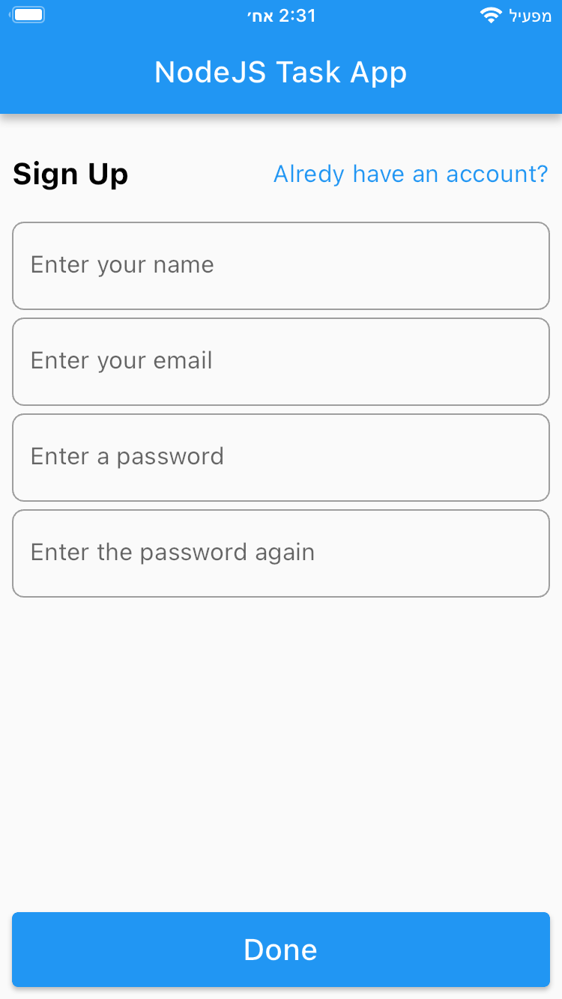
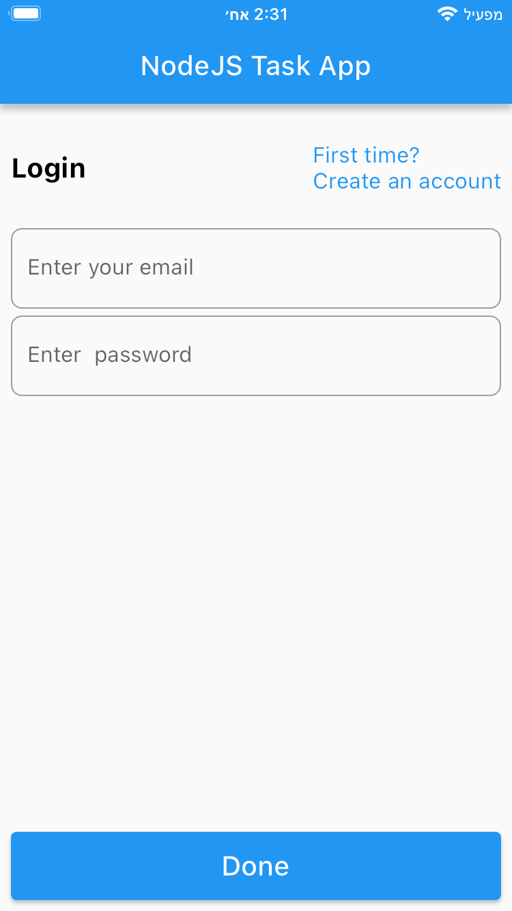
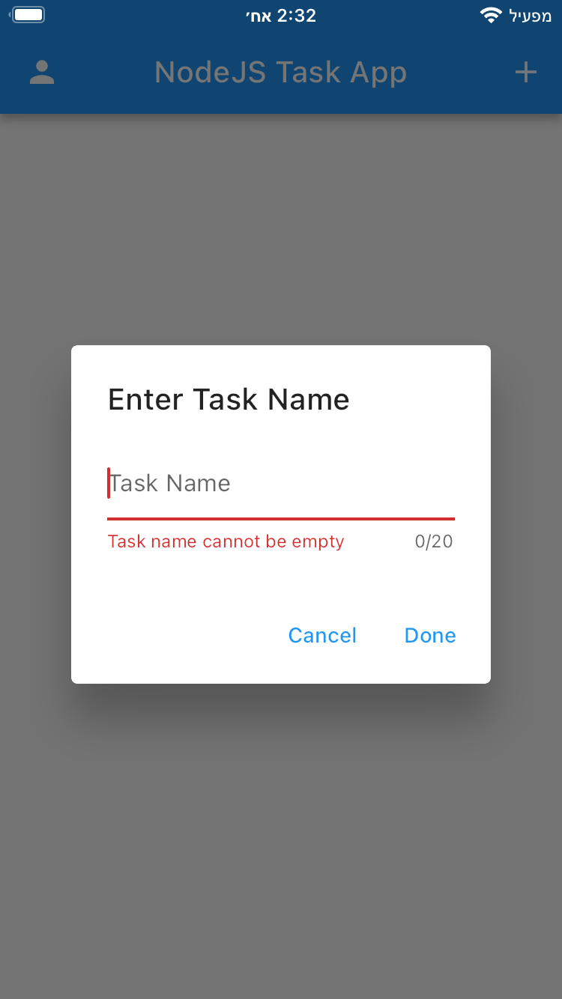
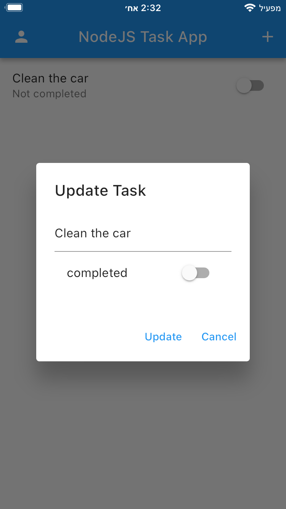
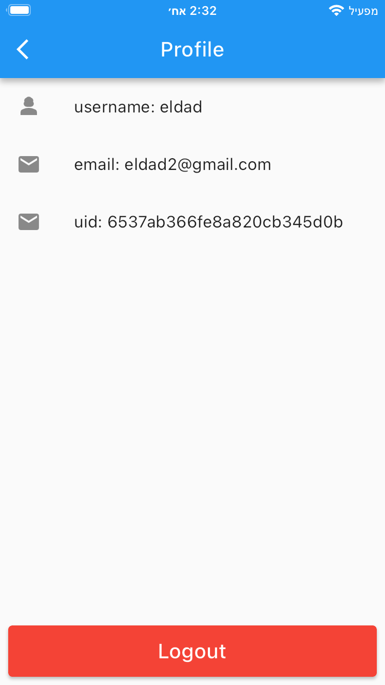

# Full-Stack Task App (Flutter + NodeJS)

This project is a simple task management application developed to demonstrate clean code principles, basic UI design, and full-stack development using Flutter and NodeJS. The aim of this project is to showcase a clean code approach and a well-organized folder structure, making it an excellent resource for learning and understanding modern software development practices.

## Features and Technologies Used:

1. **Authentication with Node server (JWT):** Implemented secure user authentication using JSON Web Tokens (JWT) for enhanced security.
2. **API Development and Deployment:** Developed robust APIs for the task app, ensuring seamless communication between the frontend and backend.
3. **Error Handling in the Server Side:** Implemented effective error handling mechanisms on the server side to enhance the stability of the application.
4. **MongoDB + Mongoose:** Utilized MongoDB, a NoSQL database, along with Mongoose, an Object Data Modeling (ODM) library for MongoDB and Node.js, to manage the application's data.
5. **Postman:** Leveraged Postman for testing API endpoints and ensuring they function as intended.
6. **SwaggerUI:** Implemented SwaggerUI for interactive API documentation, making it easier for developers to understand and work with the APIs.
7. **Bloc:** Utilized the Bloc pattern for state management in the Flutter application, ensuring a clear separation of concerns and a reactive user interface.
8. **GetIt (Dependency Injection):** Implemented dependency injection using GetIt to manage and inject dependencies throughout the Flutter app, promoting modularity and testability.
9. **Dio (HTTP Calls):** Utilized Dio, a powerful HTTP client for Dart, to make efficient and reliable HTTP requests from the Flutter app to the backend server.

# Project Folder Structure Summary

This project follows a structured and modular organization to enhance maintainability and scalability. Below is a summary of the key directories and their purposes:

- **`lib/common/`**: Contains reusable components and helper functions used across the application, promoting code reusability and consistency.

- **`lib/config/`**: Manages the application's configuration settings, including routes and themes, ensuring centralized management of app-wide settings.

- **`lib/core/`**: Houses fundamental application logic such as constants, data state management, and use cases, maintaining a clean separation of concerns.

- **`lib/di/`**: Placeholder for dependency injection configurations, ensuring a centralized setup for managing dependencies.

- **`lib/features/`**: Organized by feature modules, each module contains its own data, domain, and presentation layers, enabling modular development and easy feature-specific updates.

  - **`lib/features/Profile/`**: Example feature module, illustrating the structure:
    - **`data/`**: Manages data sources, including local storage and API interactions.
    - **`domain/`**: Contains business logic entities, repositories, and use cases specific to the feature.
    - **`presentation/`**: Includes BLoC (Business Logic Component) for state management, UI components, and feature-specific pages and widgets.

  - **`lib/features/auth/`**, **`lib/features/daily_news_example_feature/`**, **`lib/features/tasks/`**: Additional feature modules organized in a similar manner.

- **`lib/home_page.dart`**: Main entry point for the home page of the application.

- **`lib/injection_container.dart`**: Manages dependency injection for the application, ensuring efficient management of dependencies and services.

- **`lib/main.dart`**: The primary entry point of the application, initiating the app and routing to the initial screen.

This structured approach encourages a modular and organized codebase, making it easier to understand, maintain, and extend the application. Each module encapsulates its functionality, allowing developers to work on specific features independently. Feel free to explore these directories for a deeper understanding of the project's architecture and components. Happy coding! 🚀

  
  
  
  
  

